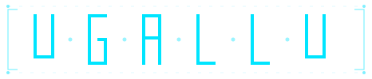

<p align="center">
  
</p>

<p align="center">
  <a href="https://github.com/ninsun-labs/ugallu/actions/workflows/ci.yml"></a>
  <a href="https://github.com/ninsun-labs/ugallu/releases"></a>
  <a href="https://github.com/ninsun-labs/ugallu/blob/main/LICENSE"></a>
  <a href="https://goreportcard.com/report/github.com/ninsun-labs/ugallu/sdk"></a>
  <a href="https://pkg.go.dev/github.com/ninsun-labs/ugallu/sdk"></a>
  <a href="https://ugallu.io"></a>
  <br>
  <a href="https://github.com/ninsun-labs/ugallu/stargazers"></a>
  <a href="https://github.com/ninsun-labs/ugallu/issues"></a>
  <a href="https://github.com/ninsun-labs/ugallu/pulls"></a>
  <a href="https://github.com/ninsun-labs/ugallu/commits/main"></a>
  <a href="https://github.com/sigstore/cosign"></a>
  <a href="https://kubernetes.io"></a>
</p>

# ugallu

Kubernetes-native security platform. Eleven operators share one
versioned API surface (`security.ugallu.io/v1alpha1`) and one
cosign-keyless supply chain, so detection, response and audit live
in the same place your workloads do.

Built first for [Cilium](https://cilium.io)-native clusters; every
operator works on any compliant CNI, on Cilium the platform takes
the higher-resolution path.

> **Status:** `v0.1.0-alpha.1` (first public release). Pre-`v1.0.0`
> minor versions may break compat; breaking changes are called out
> at the top of every [CHANGELOG](CHANGELOG.md) entry.

Full documentation lives at **[ugallu.io](https://ugallu.io)**:
architecture, per-operator pages, CRD reference, operations
guide, and task-oriented recipes.

<p align="center">
  <a href="https://github.com/ninsun-labs/ugallu/graphs/contributors"></a>
</p>

## What ships

| Layer | Component | Description |
|---|---|---|
| SDK runtime | `resolver` | DaemonSet, eBPF cgroup tracker + informer cache, gRPC subject lookup |
| SDK runtime | `attestor` | Deployment singleton, in-toto pipeline (Fulcio + Rekor + WORM) |
| SDK runtime | `ttl` | Lifecycle GC + per-severity retention + WORM archive snapshots |
| SDK runtime | `backpressure` | Cluster-wide rate limiter for the emitter SDK |
| Detection | [`audit-detection`](operators/audit-detection) | Apiserver audit log -> Sigma rule engine -> SecurityEvent |
| Detection | [`dns-detect`](operators/dns-detect) | CoreDNS plugin or Tetragon kprobe -> 5 detectors (exfil / tunneling / blocklist / young-domain / anomalous-port) |
| Detection | [`tenant-escape`](operators/tenant-escape) | Cross-tenant Secret / HostPath / NetworkPolicy / Exec detection |
| Detection | [`honeypot`](operators/honeypot) | Decoy Secret + ServiceAccount tripwires |
| Detection | [`webhook-auditor`](operators/webhook-auditor) | Continuous risk scoring of admission webhook configs |
| Forensic | [`forensics`](operators/forensics) | SE-triggered IR-as-code pipeline (freeze + snapshot + WORM + unfreeze) |
| Forensic | [`gitops-responder`](operators/gitops-responder) | EventResponse -> PR/MR on the GitOps repo |
| Compliance | [`backup-verify`](operators/backup-verify) | Velero / etcd-snapshot integrity check with optional sandbox restore |
| Compliance | [`compliance-scan`](operators/compliance-scan) | kube-bench + Falco + CEL custom backends in a unified result |
| Compliance | [`confidential-attestation`](operators/confidential-attestation) | Per-node TPM 2.0 / SEV-SNP / TDX quotes |
| Policy | [`seccomp-gen`](operators/seccomp-gen) | Trace a Pod via tetragon-bridge, emit an OCI seccomp profile |
| UI | [`ugallu-ui`](cmd/ugallu-ui) + [`ugallu-bff`](cmd/ugallu-bff) | SvelteKit SPA + Go BFF, OIDC + PKCE, read-only over the CRD group |

## Repository layout

Multi-module Go workspace (`go.work`); each component is its own
module so a fix to one operator doesn't drag the whole tree.

```
sdk/                shared SDK (CRD types + emitter + resolver client + evidence pipeline)
resolver/           ugallu-resolver binary
attestor/           ugallu-attestor binary
ttl/                ugallu-ttl binary
backpressure/       ugallu-backpressure binary
cmd/ugallu/         CLI
cmd/ugallu-bff/     UI Backend-for-Frontend
cmd/ugallu-ui/      SvelteKit SPA
operators/<name>/   per-operator binaries
charts/ugallu/      umbrella Helm chart with subcharts
crds/               CRD bundle (controller-gen generated)
argocd/             ApplicationSet for deployment
docs/               architecture + deploy + reference notes
```

## Install

```bash
helm install ugallu charts/ugallu \
  --create-namespace \
  --namespace default \
  --set hardening.strict=true
```

For the full quickstart (Cilium + Tetragon + cert-manager + an OIDC
issuer for the UI) see [ugallu.io/start/quickstart](https://ugallu.io/start/quickstart/).

## Verifying a release

Every image is signed via GitHub OIDC + Fulcio + Rekor. To verify:

```bash
cosign verify \
  --certificate-oidc-issuer https://token.actions.githubusercontent.com \
  --certificate-identity-regexp 'https://github.com/ninsun-labs/ugallu/.+' \
  ghcr.io/ninsun-labs/ugallu/audit-detection:v0.1.0-alpha.1
```

The SBOM ships as a separate cosign attestation; see
[ugallu.io/ops/releases](https://ugallu.io/ops/releases/) for the
full verification flow.

## License

Apache-2.0. See [LICENSE](LICENSE). All commits require the
Developer Certificate of Origin sign-off (`git commit -s`).

## Contributing

See [CONTRIBUTING.md](CONTRIBUTING.md) and
[CODE_OF_CONDUCT.md](CODE_OF_CONDUCT.md).

## Security

Report vulnerabilities per [SECURITY.md](SECURITY.md). Do not open
public issues for vulnerabilities; use the disclosed channel
instead.
